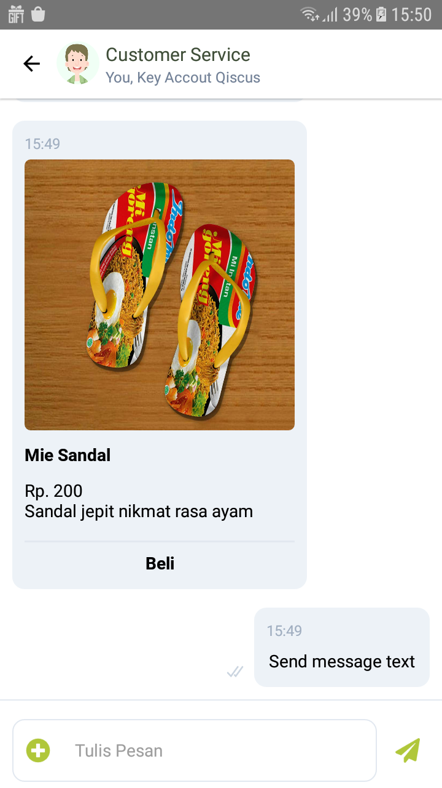
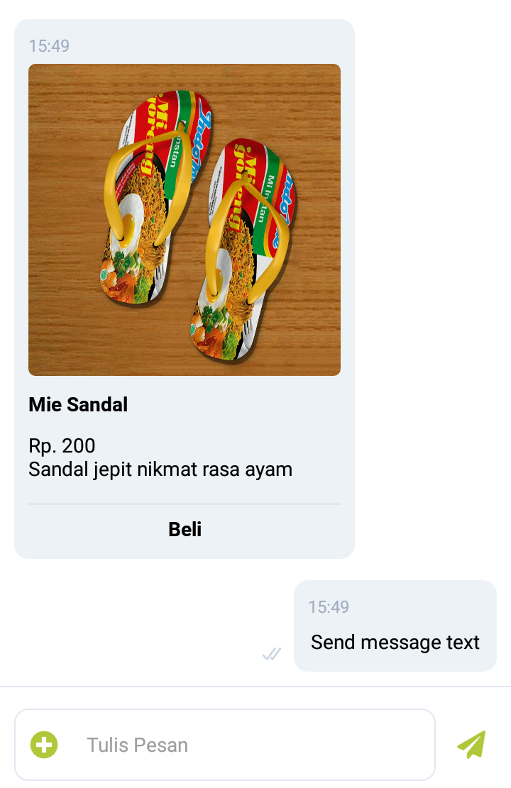

<p align="center">
    <a href="#">
      
    </a>
</p>

<h3 align="center">
  React Native Multichannel Widget
</h3>
<p align="center">
  The most complete chat UI Multichannel for React Native
</p>

## Requirements

* React Native Version >= 0.59

## Installation

* Using npm `npm i @qiscus-community/react-native-multichannel-widget`
* Using yarn `yarn add @qiscus-community/react-native-multichannel-widget`

## Configuration Widget

### 1. Add `MultichannelWidgetProvider` in App.js

We use Hooks to synchronize data. To make it work we have to explicitly insert a mount point in your app like this:

```
// in your entry file like `App.js`
import {MultichannelWidgetProvider} from '@qiscus-community/react-native-multichannel-widget';

// in your render function 
return (
  <MultichannelWidgetProvider>  // <- use MultichannelWidgetProvider
    <App />
  </MultichannelWidgetProvider>
);
```

[Reference : ExampleApp](https://github.com/Qiscus-Integration/react-native-multichannel-widget/blob/master/ExampleApp/App/index.js#L67)

### 2. Initialization Widget 

Initiate widget for first time

```
import Widget from '@qiscus-community/react-native-multichannel-widget';
const ScreenChat = () => {
const widget = Widget();
useEffect(()=>{
    //optional params
    let options = {
      baseURLMultichannel: // custom base url Multichannel
      baseURLSdk: // custom base url SDK
      mqttURLSdk: // custom mqtt url SDK
      brokerLbURLSdk: // custom broker LB url SDK
      uploadURLSdk: // custom uploader url SDK
    }
    widget.setup(AppId,options);
},[])    
....
};

```

[Reference : ExampleApp](https://github.com/Qiscus-Integration/react-native-multichannel-widget/blob/master/ExampleApp/App/screens/LoginScreen.js#L42)


> ***AppId Qiscus*** *used to initiate chat applications in qiscus, further related to AppId :* [*https://documentation.qiscus.com/latest/multichannel-customer-service/settings-and-configuration#app-information*](https://documentation.qiscus.com/latest/multichannel-customer-service/settings-and-configuration#app-information)

### 3. Initialization Chat

Initiate room chat

```
widget.initiateChat('USER_ID', 'NAME', 'FCM_TOKEN')
  .then(result => {
                
  })
  .catch(e => {
                
  })
```

[Reference: ExampleApp](https://github.com/Qiscus-Integration/react-native-multichannel-widget/blob/master/ExampleApp/App/screens/HomeScreen.js#L55)

```
# Description
USER_ID   : unique indentifier of a user
NAME      : display name of a user
FCM_TOKEN : device token from fcm, used for push notification needs
```

### 4. Use Header Component

Using component header

<kbd></kbd>

```
<Header
  height={56}
  style={{
    backgroundColor : 'orange'
  }}
  textColor = 'white'
/>
```

**Props**

* `title` *(String)* - Custom title
* `subtitle` *(String)* - Custom subtitle
* `avatar` *(Object)* -  Extra props to be passed Component to custom avatar
* `height` *(Integer)* - Height of the Header, default is `56`
* `headerRight` *(Object)* - Extra props to be passed Component to the Right Header
* `headerLeft` *(Object)* - Extra props to be passed Component to the Left Header
* `style` *(Object)* - Extra props to be passed custom style header
* `textColor` *(String)* - Custom text color header

[Reference : ExampleApp](https://github.com/Qiscus-Integration/react-native-multichannel-widget/blob/master/ExampleApp/App/screens/ChatScreen.js#L22)

### 5. Use Chat Room Component

Using chat room component

<kbd></kbd>

```
<MultichannelWidget
  onSuccessGetRoom={room => {
  }}
  onDownload={onDownload}
  onPressSendAttachment={onPressSendAttachment}
/>
```

**Props**

* `onSuccessGetRoom` *(Function(`room`))* - Callback when success get room
* `onPressSendAttachment` *(Function)* - Callback when button Send Attachment is tapped
* `onDownload` *(Function)* - Callback when a download message attachment is tapped
* `renderSendAttachment` *(Object)* - Extra props to be custom Component button Send Attachment
* `renderSendMessage` *(Object)* - Extra props to be custom Component button Send Message
* `renderSendMessage` *(Object)* - Extra props to be custom Component button Send Message
* `placeholder` *(String)* - Extra props to be custom placeholder, default `Type a message...`
* `renderTickSent` *(Object)* - Extra props to be custom Component Tick Sent
* `renderTickDelivered` *(Object)* - Extra props to be custom Component Tick Delivered
* `renderTickRead` *(Object)* - Extra props to be custom Component Tick Read
* `renderTickPending` *(Object)* - Extra props to be custom Component Tick Pending
* `filterMessage` *(Function(message))* - Extra props to filter list message

[Reference : ExampleApp](https://github.com/Qiscus-Integration/react-native-multichannel-widget/blob/master/ExampleApp/App/screens/ChatScreen.js#L222)

## Get Unread Message Count

To get unread message count, you can use getUnreadCount method like below.

```
widget.getUnreadCount(callback)
```

## End Session User

To request end session or end chat, you can use endSession method like below.

```
widget.endSession()
```

## Remove Notification

At the logout action from the app, you need to implement removeNotification method like below to remove FCM_TOKEN from Qiscus Server, that means Qiscus Server not sending push notifications again to the device.

```
widget.removeNotification('FCM_TOKEN')
```

> *FCM_TOKEN is the same value when first initiation in step:* [3. Initialization Chat](#3-initialization-chat) link

## Get Qiscus SDK Service

To get Qiscus functionalities, you can import Qiscus like below.

```
import {Qiscus} from '@qiscus-community/react-native-multichannel-widget';
```

```
// another example to get room object from qiscus
import {Qiscus} from '@qiscus-community/react-native-multichannel-widget';

let room = Qiscus.qiscus.selected
```

for more methods related qiscus sdk service, you can read on this link : https://github.com/Qiscus-Integration/react-native-multichannel-widget/blob/master/lib/services/qiscus/index.js

[Reference : ExampleApp](https://github.com/Qiscus-Integration/react-native-multichannel-widget/blob/develop/ExampleApp/App/screens/ChatScreen.js#L213-L214)

## Example App

[ExampleApp](https://github.com/Qiscus-Integration/react-native-multichannel-widget/tree/master/ExampleApp) folder contains an example app to demonstrate how to use this package.

**How to run the example app** 

* Clone or download this repo
* Open ExampleApp directory
* create new file with name `.env` file like .[env_sample](https://github.com/Qiscus-Integration/react-native-multichannel-widget/blob/develop/ExampleApp/.env_sample) add **APP_ID** with your Multichannel AppId
* Open your terminal or cmd and execute `npm install` command
* To run the Example App you need to execute `react-native run-android` command and wait for the process to complete

## Push Notification

To implement push notification in react native widget you need to add FCM Key in notifications setting, below is how to do it, you need to read in “**Android's Customer Widget Push Notification”** section
https://documentation.qiscus.com/multichannel-customer-service/settings-and-configuration#notifications 

## References

* Multichannel Mobile in app widget from scratch : https://documentation.qiscus.com/multichannel-customer-service/channel-integration#mobile-in-app-widget
* Mobile App push notification : https://documentation.qiscus.com/multichannel-customer-service/channel-integration#mobile-app-push-notification

